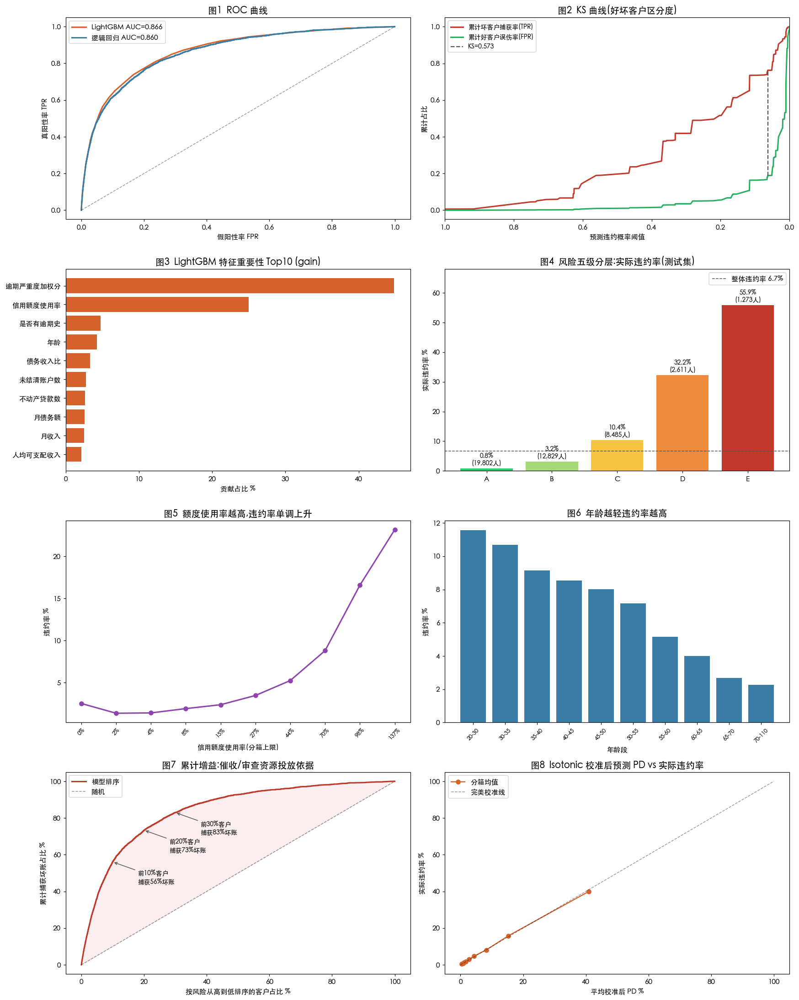

# 信用违约风险预测模型(Credit Default Risk Prediction)

> 机器学习 · 风控建模 · 财务视角 | LightGBM + 评分卡方法论(WOE/IV) + SHAP 可解释性

基于 **15 万条真实信贷数据**(Kaggle "Give Me Some Credit")构建违约概率模型,并将模型输出翻译为**应收账款管理的财务决策语言**:差异化风险监控、催收优先级排序、授信预警线。

| 指标 | 结果 |
|---|---|
| 冻结测试集 AUC | **0.866** |
| 冻结测试集 KS | **0.573** |
| 5 折 CV 稳定性 | 0.864 ± 0.004（与主模型同一套 17 个特征） |
| 概率校准 | Brier **0.132 → 0.049** |
| 业务转化 | 前 10% 高风险客户捕获 **56%** 全部坏账 |



## 项目亮点

1. **真实脏数据处理**:19.8% 非随机收入缺失(缺失标记而非删除)、96/98 特殊编码(截断+标记,因其违约率约 55%,是信号非噪音)、比率字段量纲爆炸(99.5 分位截断)——每条清洗决策都有业务理由
2. **财务视角特征工程**:自建"账龄加权逾期严重度分"(delinq_score),IV 达 1.22 登顶全部 17 个特征,验证账龄加权这一财务直觉在数据上成立
3. **评分卡方法论**:WOE/IV 变量筛选,量化验证"历史付款行为的预测力是财务状况类变量的 10 倍以上"
4. **无泄漏实验设计**:清洗统计量仅在训练折拟合；验证集**再拆成互不相交的选模子集与校准子集**——树数选择与风险阈值走选模子集，Isotonic 校准器只在校准子集拟合，避免同一批样本三重复用；测试集只用于最终一次评估
5. **可解释性落地**:SHAP 单客户归因,三个代表案例(高危/边界/白名单)展示"每个模型决策可追溯到具体特征",回应财务/审计场景对黑箱模型的质疑
6. **业务闭环**:冻结阈值后五级风险分层(E 层实际违约率 54.6% vs A 层 0.9%)→ 三项可落地财务策略

完整分析过程、结果解读与案例分析见 **[docs/analysis_report.md](docs/analysis_report.md)**。

## 快速开始

```bash
# 1. 克隆并安装依赖
git clone https://github.com/Elias-love/credit-default-risk.git
cd credit-default-risk
pip install -r requirements.txt

# 2. 下载数据(公开镜像,约 7MB)
curl -L "https://codeload.github.com/streety/GiveMeSomeCredit/tar.gz/refs/heads/master" -o gmsc.tar.gz
tar xzf gmsc.tar.gz && cp GiveMeSomeCredit-master/cs-training.csv data/ && rm -rf gmsc.tar.gz GiveMeSomeCredit-master

# 3. 按顺序运行(step2-4 依赖上一步输出)
python src/step1_eda.py          # 探索性分析:目标分布/缺失/异常
python src/step2_clean_woe.py    # 清洗 + 特征工程 + WOE/IV
python src/step3_model.py        # 逻辑回归基线 + LightGBM + 风险分层
python src/step4_viz_cases.py    # 8 张图表 + SHAP 个体案例归因
```

> **macOS 提示**：LightGBM 依赖 OpenMP 运行库。若 `import lightgbm` 报
> `Library not loaded: @rpath/libomp.dylib`，需先 `brew install libomp`；
> 已有 libomp 但不在默认搜索路径时，可用 `DYLD_LIBRARY_PATH=<libomp所在目录> python src/step3_model.py`。

全流程固定随机种子；`src/modeling.py` 封装可复用的 sklearn 特征转换器，交叉验证每折独立拟合预处理统计量，
并由 `ModelFeatureSelector` 把 CV 的特征集收敛到与主模型完全一致的 17 个，保证两个 AUC 同口径可比。

## 目录结构

```
├── src/                 # step1~step4 四个分析脚本(按序运行) + modeling.py(可复用组件)
├── tests/               # 单元测试(7 用例)：python -m pytest
├── docs/                # 完整分析报告(过程/解读/案例)
├── assets/              # 图表与 IV 排名
├── data/                # 数据目录(需按上述命令自行下载,不入库)
├── .github/workflows/   # CI
└── requirements.txt
```

## 局限与说明

- 数据为**个人信贷**场景;企业应收账款建模需替换特征体系(回款账期偏离度、订单集中度、争议发票率等),但方法论完全同构
- 数据无时间戳,未做 out-of-time 验证;生产环境须按时间切分并以 PSI 监控模型漂移
- 已用独立校准子集完成 Isotonic 校准，分层阈值取自校准器未见过的选模子集（脚本会打印阈值健康度，退化时直接报错）；若迁移到新客群/新时间窗口，仍需重新校准并监控 Brier/PSI
- 本地随机测试集与 Kaggle 竞赛私榜不是同一测试集，因此不作冠军成绩横向对比
- 本项目只覆盖 PD 排序/校准；正式 ECL 还需 EAD、LGD、宏观情景与分期规则
- 数据源为 Kaggle 公开竞赛数据,仅用于学习研究

## 路线图

- [ ] Streamlit 交互式风险看板(客户列表 + 风险分 + SHAP 瀑布图)
- [ ] 与 [finance-rag-qa](https://github.com/Elias-love/finance-rag-qa) 的 NL2SQL 模块打通,实现"一句话查客户风险画像"
- [x] Isotonic 概率校准层 + 冻结风险阈值（校准与定阈使用互不相交的验证子集）

## License

MIT
